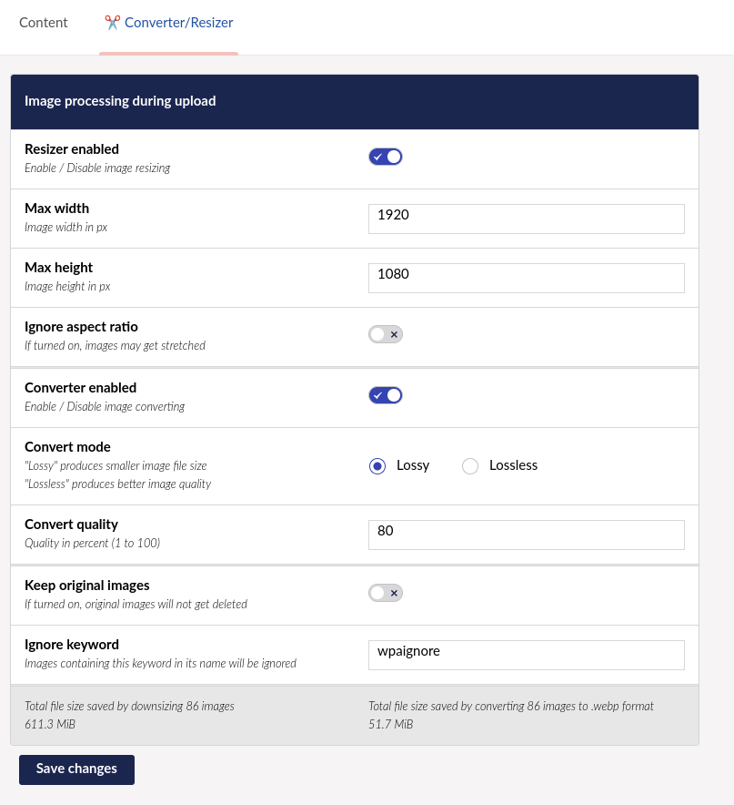

# Badgernet.Umbraco.WebPicAuto

### Resizes and converts your images to .webp format on upload.

\
[](https://www.nuget.org/packages/Badgernet.Umbraco.WebPicAuto/)

# Installation
Simply add the package by using dotnet add package to install the latest version:
```
dotnet add package Badgernet.Umbraco.WebPicAuto
```

# Changelog

#### Version 1.1.0
- Backoffice dashboard


#### Version 1.0.1 
- Added option to downscale images without keeping aspect ratio
- Provide target dimensions in filename -> "wparesize_800_600_ImageName.png"
    

# Settings
You can change these default settings by accessing the "Converter/Resizer" dashboard in the Media section in backoffice.



## Resizer enabled
Turns image resizing on or off 

## Max width
Resizer will scale images down to fit max width value

## Max height
Resizer will scale images down to fit max height

## Ignore aspect ratio
By default, resizing will maintain image aspect ratio. 

## Converter enabled
Turns image converting on or off

## Convert mode
#### Image encoding type 
"Lossy" mode will produce smaller file size images. <- this is the preferred / default mode  \
"Lossless" mode will produce better quality images.

### Convert quality
#### Value from 1 to 100
Quality of conversion, lower value will produce smaller file size images but image quality will also be worse.

### Keep original images
If turned on, original images will not be deleted (wwwroot/media/***) 
### Ignore keyword
Any images containing this keyword in its filename will be ignored by this package. -> "wpaignore_IMG01012024.png" would not get processed.


# Credits
Thanks to everybody at [@Our Umbraco Forum]([https://our.umbraco.com/forum/]) for their helpful tips. \
This project was inspired by [@VirjdagOnline.ImageResizer]([https://www.nuget.org/packages/VrijdagOnline.ImageResizer])
